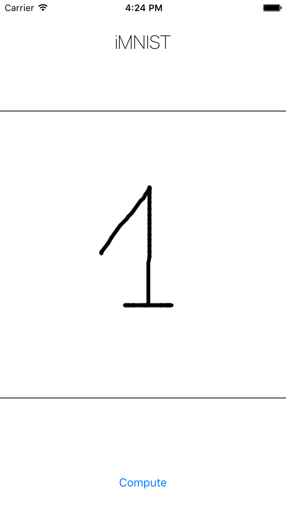

# iMNIST
iMNIST is a iOS app that recognizes the digits you draw using a trained TensorFlow NN. 

## How to intall it?

Requirements : 
  
- `Xcode 8` 
- A device or simulator under `iOS 10`.
- `Accelerate` is needed for that app. We need one of its subset called [BNNS](https://developer.apple.com/reference/accelerate/1912851-bnns). Make sure it is imported in **Targets -> iMNIST -> General -> Linked frameworks and libraries**.

Clone the repo, open it in Xcode and sign it with your own developer profile.

Nota bene : The code was written following the [Swift 3](https://developer.apple.com/library/content/documentation/Swift/Conceptual/Swift_Programming_Language/index.html#//apple_ref/doc/uid/TP40014097-CH3-ID0) syntax. 

## How does it work ? 

### UI
Here is a capture from the app :

- The user draws a figure between the two lines.
- He presses the compute button and the app will try to guess what figure was drawn.
- The drawn figure disappears.

### In-depth

To achieve this simple functionnality the following steps are necessary. 

Prior to app launch : 

- Export the weights and biases from the MNIST simple model from [TensorFlow website](https://www.tensorflow.org/versions/r0.11/tutorials/mnist/beginners/index.html#mnist-for-ml-beginners). They appear in the app Bundle as **"weights.data"** and **"bias.data"**.

The user draws on the screen.

- Convert the user drawing to an UIImage.
- Create a 28*28 grayscale representation of that UIImage (to be compliant with MNIST requirements).
- Convert that UIImage to a normalized vector representation of the pixels values (they must be between 0 and 1).
- Import the data from **"weights.data"** and **"bias.data"** and parse it.
- Build a BNNS model from the biases, the weights and the input data. 
- Apply the BNNS filter gives us a vector of 10 real values.
- Apply [Softmax](https://en.wikipedia.org/wiki/Softmax_function) to the ouput vector gives us a normalized version of that vector.
- Output the highest value and show the guessed figure to the user.

## Where to go from here ?

This project was made in an attempt to do inference from a TensorFlow model on an iOS device using Apple's BNNS. The motivation for using it: BNNS processing is optimized for iOS devices CPUs.  
There is no back-propagation with BNNS though, you'll need to train the model on a server and import the weights and biases.
A pipeline with push notifications to download the new model seems relevant. 

Other solutions exists to do this on iOS:   

- [Metal Performance Shaders](https://developer.apple.com/reference/metalperformanceshaders) (optimized for iOS devices GPUs).
- [TensorFlow mobile library](https://www.tensorflow.org/mobile.html) (they say it needs a lot of memory and is only optimized for CUDA GPUs).
